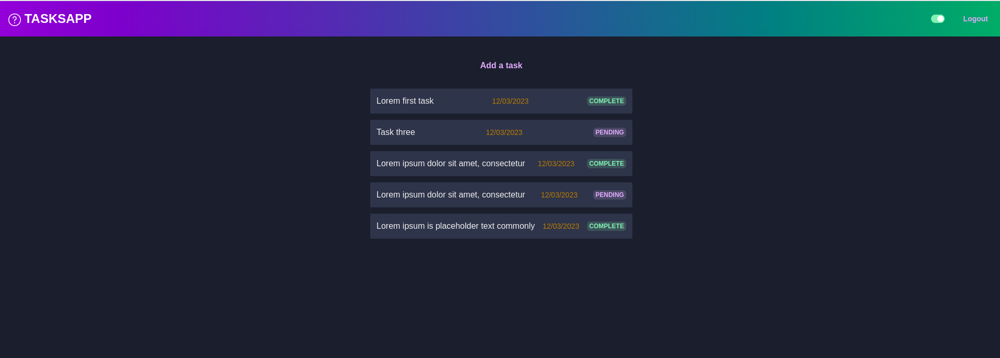
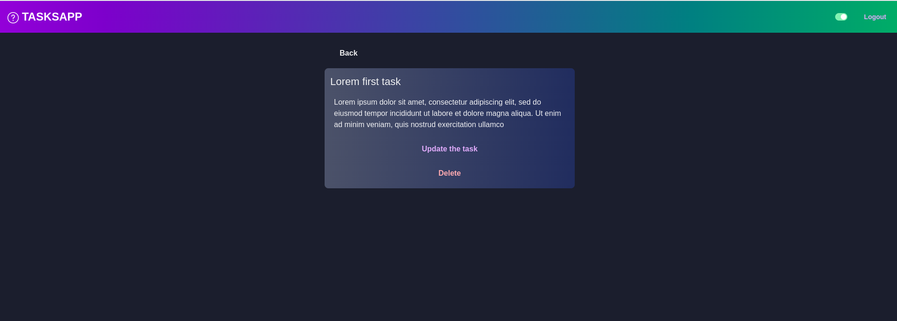
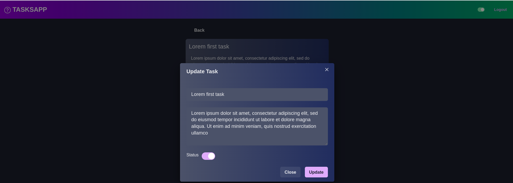

# FASTAPI REACT MONGO TODOAPP
This application provides a user-friendly interface for managing your tasks and staying organized. With React's flexible components and smooth UI updates, combined with the robustness of MongoDB's NoSQL database for data storage, and the high-performance capabilities of FastAPI for server-side operations, this todo app ensures a seamless and responsive experience.





## Goal
The project mainly aimed to put into practice knowledge of react, Mongodb and FastApi.

## Tools used
- React JS
- MongoDb
- FastApi framework

## How to test

Run on your machine:

clone project
```
https://github.com/mayosmjs/fastapi-react-mongo-TODOAPP

```
Go to projet
```
cd to Backend to start the backend services
```

### Setting up python environment

Assuming Python is installed on your local machine, execute the following command to set up a virtual environment for the project.

```bash
    cd Backend

    python -m virtualenv venv
    # OR
    python -m venv venv
    #OR
    python3 -m venv venv
    #OR
    source  venv/bin/activate.fish
    #OR
    source  venv/bin/activate.ps1
    #OR
    source  venv/bin/activate


```

### Installing backend dependencies

Assuming you are in the base directory.

```bash
cd backend
pip install -r requirements.txt


### Activating virtual environment

```bash
# Windows
cd backend
env/Scripts/activate

# Linux or unix systems
cd backend
source env/bin/activate
```

### Spin up the backend

Assuming you are in the backend directory.

```bash
    python run.py --port:8000
```
<hr>


## Spin up the Frontend

### Dependecies

Assuming you are in the base directory.

```bash
cd frontend
```

```bash
# npm
npm install

npm start

```

## Spin up the Database
Assuming that you have installed MongoDb it should be running on port 27017.
Once you start the backend server the models will be written to the DB on startup.
